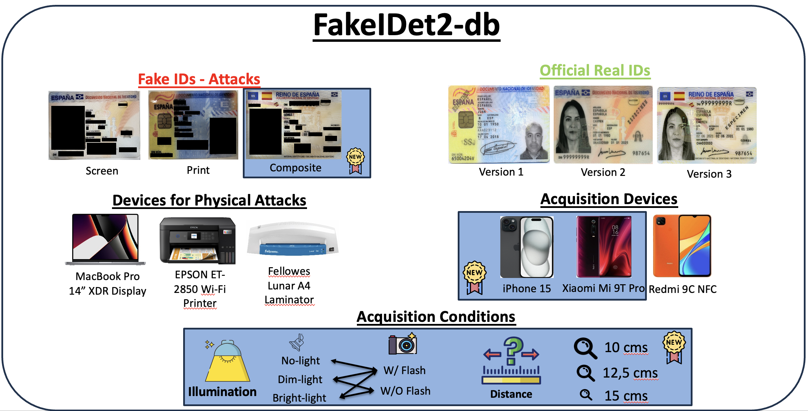

# FakeIDet2-db

## ARTICLE
J. Muñoz-Haro, R. Tolosana, J. Fierrez, R. Vera-Rodriguez and A. Morales “[Privacy-Aware Detection of Fake Identity Documents: Methodology, Benchmark, and Improved Detection Methods (FakeIDet2)
](https://arxiv.org/abs/2508.11716)”, _Under Review_. 

## DOWNLOAD INSTRUCTIONS for FakeIDet2-db
1. Download the corresponding license agreement:
    
    [[link](link)] Permanent researchers working at research or academic institutions, and selected companies generating research outcomes.
    
    Once the corresponding license agreement is signed, send the scanned copy to atvs@uam.es according to the instructions given in point 2.

2. Send an email to atvs@uam.es, as follows:

    Subject: [DATABASE download: FakeIDet2-db]

    Body: Your name, e-mail, telephone number, organization, postal mail, purpose for which you will use the database, time and date at which you sent the email with the signed license agreement.

3. Once the email copy of the license agreement has been received at ATVS, you will receive an email with a username, a password, and a time slot to download the database.

4. [Download](https://bidalab.eps.uam.es/listdatabases) the database, for which you will need to provide the authentication information given in step 4. After you finish the download, please notify by email to atvs@uam.es that you have successfully completed the transaction.

For more information, please contact: atvs@uam.es 

## DESCRIPTION OF FakeIDet2-db
FakeIDet-db is a database that comprises a total of over 900,000 patches extracted from a 1000 images of 48 official real/fake Spanish Identity Documents (ID). Figure 1 graphically summarizes the design, acquisition devices, Spanish ID layout versions and types of attacks in FakeIDet-db. 



Figure 1: Description of the FakeIDet-db database. We comprise a total of 30 Spanish IDs from 30 different people. We manufactured the screen attacks using the Macbook Pro's XDR display and the print attacks using the an EPSON ET-2850 printer and a Lunar A4 Laminator to create high-quality forgeries. Our database considers all the layouts from the different versions of the Spanish Electronic ID. The patches extracted from each real/fake document are inside a folder, each one with a random number of 6 digits, so no spatial layout can be inferred. Additionally, only the fully- and pseudo-anonymized, $64 \times 64$ patch size configurations are released. For further specifics, we refer the users to the [paper](https://arxiv.org/abs/2504.07761).

## STANDARD EXPERIMENTAL PROTOCOL

The FakeIDet-db database is divided in to two sets, one for training and one for testing. The training set comprises the 80% of the IDs, while the remaining 20% corresponds to the test set. For the set of experiments carried out in our paper, we additionally divided the training set into two subsets training and validation with a corresponding 70%/30% split. However, we encourage researchers to develop their models using which-ever proportions in the training-validation subsets they consider best.

All data is organized as follows:

```
DeepSignDB
|-- Pseudo-Anon
    |-- 64x64
        |-- Train
            |-- User_ABC
                |-- 123456.jpg
                    .
                    .
                    .
                |-- 354216.jpg
            |-- User_DEF
                |-- 123456.jpg
                    .
                    .
                    .
                |-- 354216.jpg
        |-- Test
            |-- User_UVW
                |-- 675342.jpg
                    .
                    .
                    .
                |-- 890672.jpg
            |-- User_XYZ
```
The first and second level in the database folders are the anonymization and patch size configurations. Below them in the directory tree, we find the train and test sets, where several folders that store the set of patches from a single image of an ID. 

Additionally, we designed the experimental protocol so that attacks from the [DLC-2021](https://www.mdpi.com/2313-433X/8/7/181) database are also considered. We did not consider all the videos nor all the frames from them, but a small subset of 1,500 images. The list of images will be shared in a csv file for reproducible experiments regarding out of distribution attacks once the license agreement is signed and sent to atvs@uam.es.

# EVALUATION RESULTS

Table 1 presents the results obtained using the proposed method, FakeIDet using the set-up explained above. The employed metric for performance is the Equal Error Rate (EER), and the results are at both Patch Level and ID Level.


Table 1: Results of FakeIDet-db in the FakeIDet-db database.

Furthermore, results using attacks from out-of-distribution data from the DLC-2021 database are also included in Table 2.


Table 2: Results of FakeIDet-db in the DLC-2021 database.

# REFERENCES

For further information on the database and on different extensions and systems based on this database, refer to:

* J. Muñoz-Haro, R. Tolosana, J. Fierrez, R. Vera-Rodriguez and A. Morales, “Privacy-Aware Detection of Fake Identity Documents: Methodology, Benchmark, and Improved Detection Methods (FakeIDet2)”, arXiv:2508.11716, 2025
