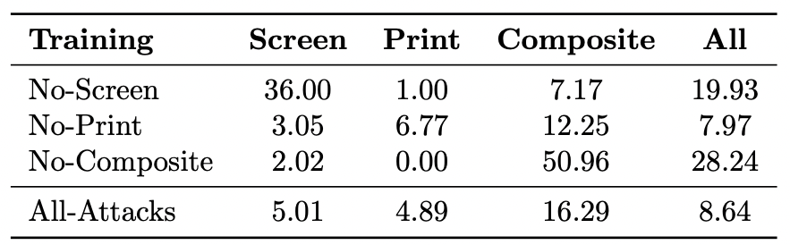
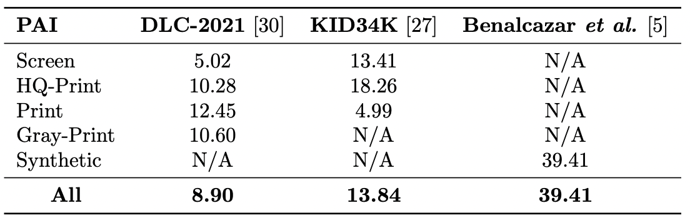

# FakeIDet2-db

## ARTICLE
J. Muñoz-Haro, R. Tolosana, J. Fierrez, R. Vera-Rodriguez and A. Morales “[Privacy-Aware Detection of Fake Identity Documents: Methodology, Benchmark, and Improved Detection Methods (FakeIDet2)
](https://www.sciencedirect.com/science/article/pii/S1566253525010310)”, Information Fusion, 2025. 

## DOWNLOAD INSTRUCTIONS for FakeIDet2-db
1. Download the corresponding license agreement in the repository:
    
    The license agreement can only be signed by permanent researchers working at research or academic institutions, and selected companies generating research outcomes.
    
    Once the corresponding license agreement is signed, send the scanned copy to atvs@uam.es according to the instructions given in point 2.

2. Send an email to atvs@uam.es, as follows:

    Subject: [DATABASE download: FakeIDet2-db]

    Body: Your name, e-mail, telephone number, organization, postal mail, purpose for which you will use the database, time and date at which you sent the email with the signed license agreement.

3. Once the email copy of the license agreement has been received at ATVS, you will receive an email with a username, a password, and a time slot to download the database.

4. [Download](https://bidalab.eps.uam.es/listdatabases) the database, for which you will need to provide the authentication information given in step 4. After you finish the download, please notify by email to atvs@uam.es that you have successfully completed the transaction.

For more information, please contact: atvs@uam.es 

## DESCRIPTION OF FakeIDet2-db
FakeIDet2-db is a database that comprises a total of over 900,000 patches extracted from a 1000 images of 48 official real/fake Spanish Identity Documents (ID). Figure 1 graphically summarizes the design, acquisition devices, Spanish ID layout versions and types of attacks in FakeIDet-db. We manufactured the screen attacks using the Macbook Pro's XDR display and the print attacks using the an EPSON ET-2850 printer and a Lunar A4 Laminator to create high-quality forgeries. New acquisition devices have been cosidered, ranging from low-end devices such as Redmi 9C NFC to high-end like the iPhone 15. Conditions of acquisition range from different distances from the ID document to different light conditions. Our database considers all the layouts from the different versions of the Spanish Electronic ID. Physical composite attacks are now considered. The patches extracted from each real/fake document are inside a folder, each one with a random number of 6 digits, so no spatial layout can be inferred. Additionally, only the fully- and pseudo-anonymized, $64 \times 64$ and $128 \times 128$ patch size configurations are released.


Figure 1: Description of the FakeIDet-db database. We comprise a total of 1,000 images from Spanish IDs from 48 different people, obtaining over 900,000 patches from real and fake IDs. For further specifics, we refer the users to the [paper](https://arxiv.org/abs/2508.11716).

## STANDARD EXPERIMENTAL PROTOCOL

The FakeIDet2-db database is divided in to two sets, one for training and one for testing. The training set comprises the 80% of the IDs, while the remaining 20% corresponds to the test set. For the set of experiments carried out in our paper, we additionally divided the training set into two subsets training and validation with a corresponding 80%/20% split. However, we encourage researchers to develop their models using which-ever proportions in the training-validation subsets they consider best.

All data is organized as follows:

```
DeepSignDB
|-- Pseudo-Anon
    |-- 64x64
        |-- Train
            |-- User_ABC
                |-- 123456.jpg
                    .
                    .
                    .
                |-- 354216.jpg
            |-- User_DEF
                |-- 123456.jpg
                    .
                    .
                    .
                |-- 354216.jpg
        |-- Test
            |-- User_UVW
                |-- 675342.jpg
                    .
                    .
                    .
                |-- 890672.jpg
            |-- User_XYZ
    |-- 128x128
|-- Fully-Anon
    |-- 64x64
        .
        .
        .
    |-- 128x128
        .
        .
        .
```
The first and second level in the database folders are the anonymization and patch size configurations. Below them in the directory tree, we find the train and test sets, where several folders that store the set of patches from a single image of an ID. 

Additionally, we designed the experimental protocol so that attacks from other databases from the state of the art are considered:

* [DLC-2021](https://www.mdpi.com/2313-433X/8/7/181) database. We did not consider all the videos nor all the frames from them, but a subset of 30,000 images. 
* [KID34K](https://dl.acm.org/doi/10.1145/3583780.3615122) database. We considered a total of 17,700 images from the whole database, sampled from both train and test sets.
* [BenalcazarDB](https://github.com/jedota/Synthetic_ID-Card_Image) database. We considered the whole database (4,000 synthetic images).

The list of images will be shared in a csv file for reproducible experiments regarding out of distribution attacks once the license agreement is signed and sent to atvs@uam.es.

# EVALUATION RESULTS

Table 1 presents the results obtained using the proposed method, FakeIDet2 in a leave-one-attack-out training scenario. The bottom row showcases the performance when all attacks are available in both training and testing stages. These experiments are performed using the Pseudo-Anon $64 \times 64$ configuration.


Table 1: Results of FakeIDet2 in scenarios where different attacks are left out of the training set using FakeIDet2. Additionally, results when all attacks are seen in the training stage are also available.

Furthermore, results using attacks from out-of-distribution data from the DLC-2021, KID34K and BenalcazarDB database are also included in Table 2.



Table 2: Results of FakeIDet2 in the DLC-2021, KID34K and BenalcazarDB databases. These results are obtained using **ONLY** our FakeIDet2-db.

# REFERENCES

For further information on the database and on different extensions and systems based on this database, refer to:

* J. Muñoz-Haro, R. Tolosana, R. Vera-Rodriguez, A. Morales and J. Fierrez, “FakeIDet: Exploring Patches for Privacy-Preserving Fake ID Detection”, In Proc. IJCB 2025.

